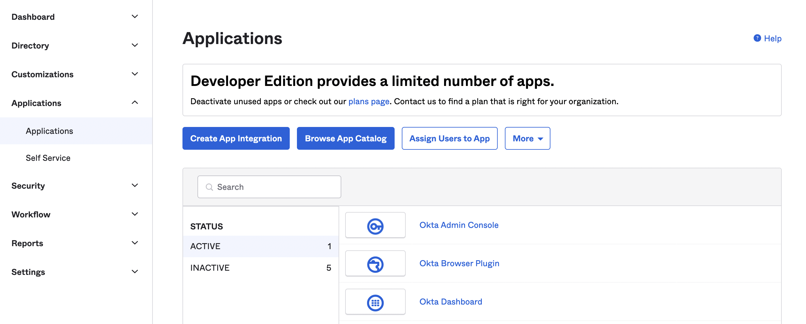
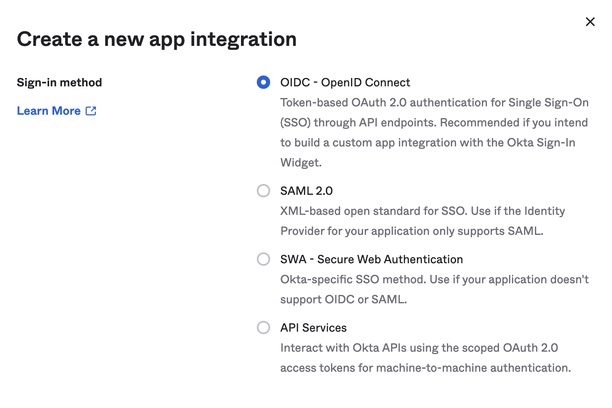
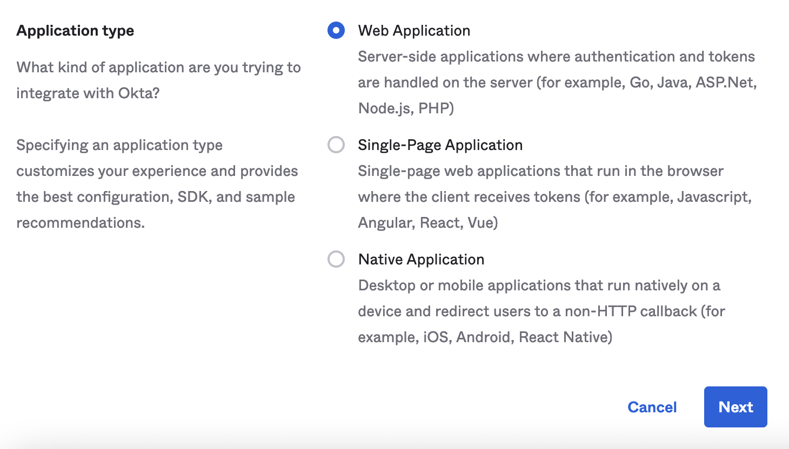
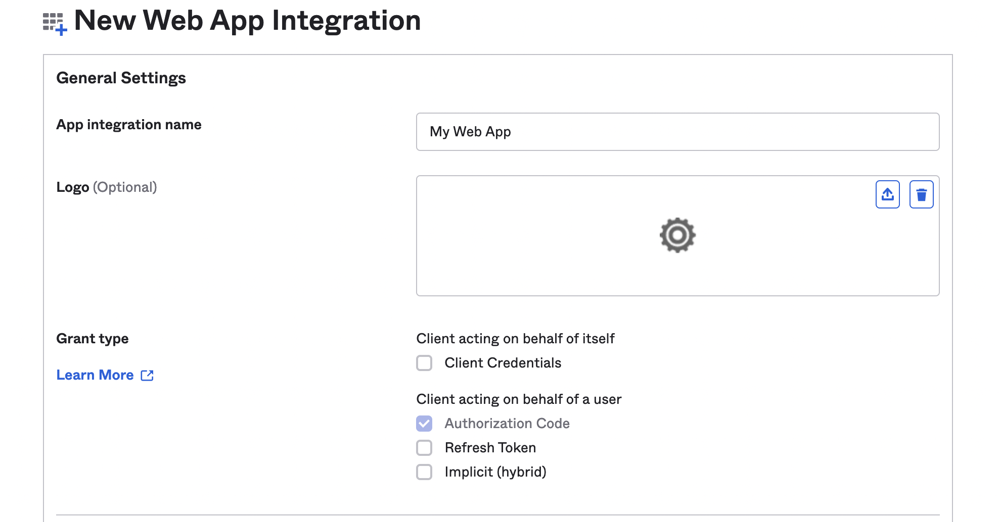
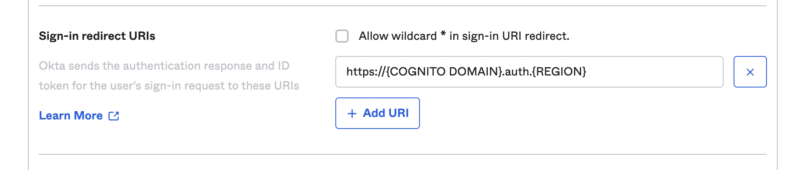
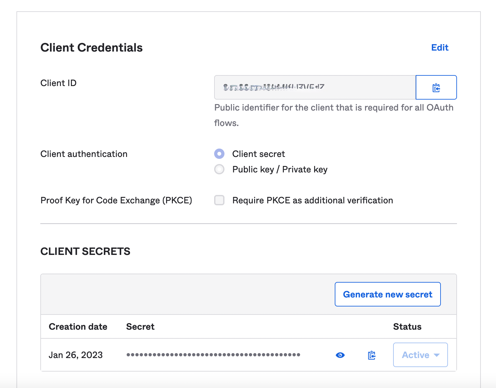
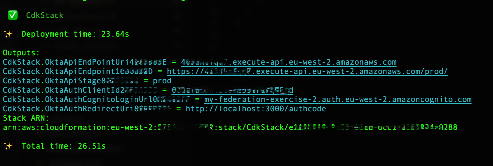
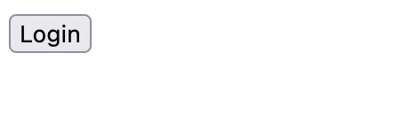
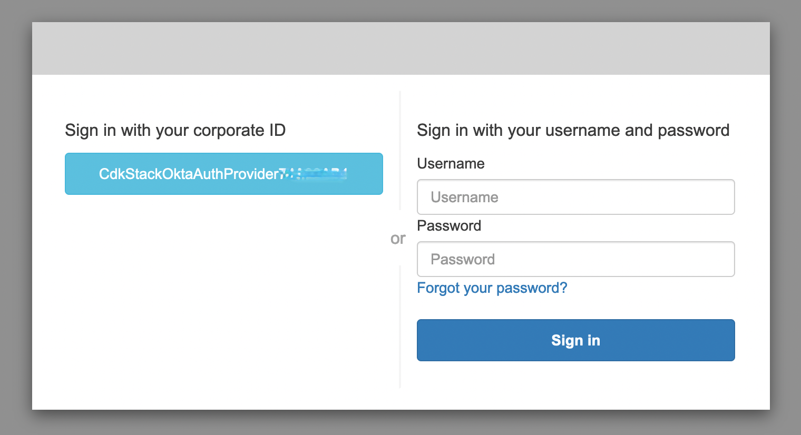
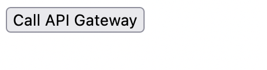

# Example of accessing Amazon API Gateway with Amazon Cognito User Pools and Okta OpenID Connect Federation

The purpose of this codebase is to illustrate a possible implementation of the [Authorization Code grant type](https://oauth.net/2/grant-types/authorization-code/), with [Amazon Cognito](https://aws.amazon.com/cognito/) and an OpenID Connect provider. The access token, retrieved as the final outcome of the flow, is then used by the client to access an endpoint, exposed by [Amazon API Gateway](https://aws.amazon.com/api-gateway/) and implemented by an [AWS Lambda](https://aws.amazon.com/lambda/) function.

The client is made of 2 software components: some basic HTML and JavaScript code runing in the user agent (browser) and an [Express](https://expressjs.com/) application running on [Node.js](https://nodejs.org
).

On the server side, Amazon Cognito includes a dedicated user pool, associated to [Okta](https://www.okta.com/), which is the selected OpenID Connect identity provider.

The sequence of calls to complete authorisation and resource retrieval is as follows:

Upon successful authentication with Okta, Amazon Cognito creates a user in the configured user pool, which you can see in the AWS Management Console.

## Pre-requisites
1. [CDK setup](https://cdkworkshop.com/15-prerequisites.html)
2. Node.js installed

## Setup steps
1. Setup a [free trial account at Okta](https://developer.okta.com/signup/)
2. Copy your account domain from the top right part of the screen, it looks like _dev-{NUMBER}.okta.com_
3. Create a new [OpenID Connect (OIDC) app integration](https://help.okta.com/en-us/Content/Topics/Apps/Apps_App_Integration_Wizard_OIDC.htm):

    1. On the left sidebar navigation menu, select _Applications_ => _Applications_
    2. Select _Create App Integration_

    

    
    

    3. Select _OIDC - OpenID Connect_

    

    
    

    4. On the same screen select _Web Application_

    

    
    

    5. Assign a name of your choice to _App integration name_ (note: _Grant type_ = _Authorization Code_ will be auto-selected)

    

    
    

    6. Assign the following value to _Sign-in redirect URIs_: _https://{COGNITO DOMAIN}.auth.{REGION}.amazoncognito.com/oauth2/idpresponse_, where _{COGNITO DOMAIN}_ is a unique value of your choice and _{REGION}_ is the Region you selected on your AWS account

    

    
    

    7. For the purpose of this exercise, under _Controlled access_, select _Allow everyone in your organization to access_ and click save
    8. After saving, copy _Client ID_ and _Secret_ under _CLIENT SECRETS_

    

    
    

4. Fill in cdk/config.json according to the comments in the file
5. _cd_ to the cdk directory and run _npm install && cdk deploy_ on a Terminal window
6. Note the _Outputs_ section of the log:

7. Fill in src/config.js according to the output above and the comments in the file

## Run steps
1. _cd_ to the src directory and run _npm install && npm start_
2. On a browser, navigate to _http://localhost:3000/_
3. Tap _Login_

4. Select Okta authentication from the next screen (_Sign in with your corporate ID_)

5. Authenticate with your Okta user

6. After redirection, tap _Call API Gateway_
7. If all ok, you will be able to see the message _Hello! You've successfully hit /hello_

## Security

See [CONTRIBUTING](CONTRIBUTING.md#security-issue-notifications) for more information.

## License

This library is licensed under the MIT-0 License. See the LICENSE file.